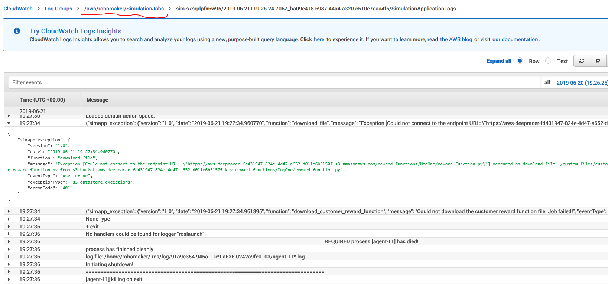
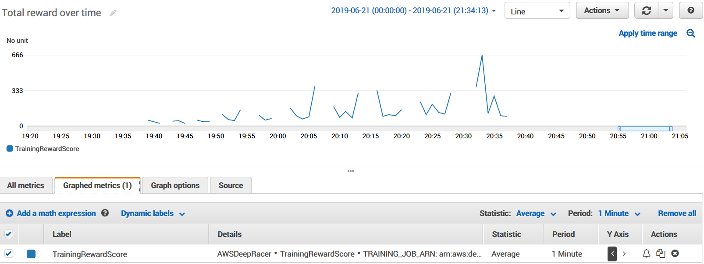
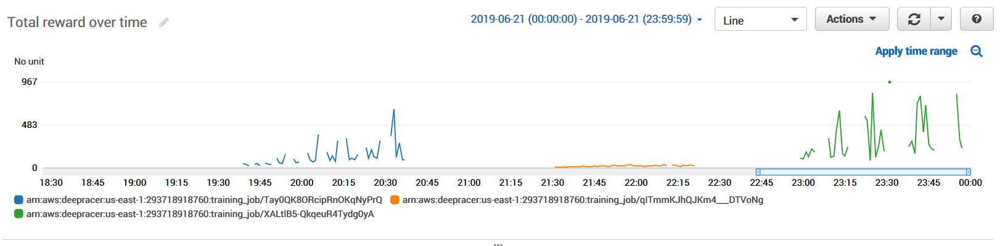
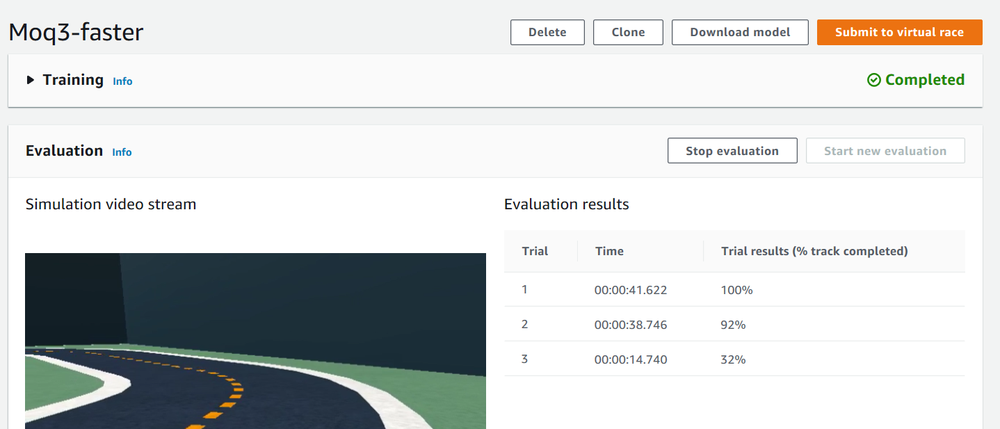
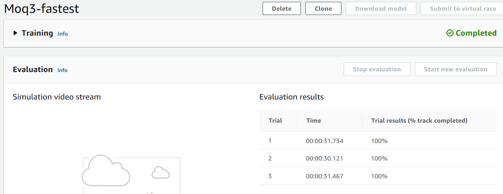
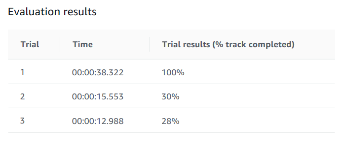

# Simulator Trials

## MoqOne

The first attempt failed due to an agent process crash.

## Moq2

The next attempt used all defaults and trained for `1 hour`

- Max Speed: 1 mps
- Script: [HelloWorld](HelloWorld.py)
- Granularity : 2 speeds
- Action Space : 10 choices
- Best Lap: `1:06.7`

## MoqFast

The next attempt was trained for `1 hours`

- Max Speed: 6mph
- Script: [HelloWorld](HelloWorld.py)
- Granularity: 3 speeds
- Angles: 7
- Action Space: 20

This would take a long time to converge but did provide new insights.

The biggest challenge was accelerating around corners and off the track. This would suggest that we need to account for the tuple `(steering_angle, max_speed)`.

## Moq3

This is a clone of Moq2 with `1 hour training`

It uses the [Moq3.py](Moq3.py) script to give a combined score of `near_center * has_correct_heading`. The theory is that this will become the foundation for addition additional properties.

After an hour here are the results of [Moq3.py]:

- Blue = Moq2 (follow center)git add 
- Orange = MoqFast (follow center + cranked up)
- Green = Moq3 (follow center + correct_heading)

This algo hit a peak of 967 compared to Moq2 only reached 663. It also converged to higher scores within 10 minutes or and performed well until the end. The next step is to add an option of additional speed

The fastest lap was `1:08.1` which is comparable to Moq2 and confirms that we need to _go faster_.

## Moq3-faster

The [Moq3.py](Moq3.py) script was executed against the default parameters.

- Moq3-faster: Speed <= 2mps
- Moq3-fastest: Speed <= 3mps

These were both executed in parallel to speed up collecting results.

## Moq4

The [Moq4.py](Moq4.py) script extends Moq3 with penalty for the car `speed<=0.5` and `max speed=2.0`

There is some effort required for more stability but it did complete one iteration in `0:38.3` seconds.

