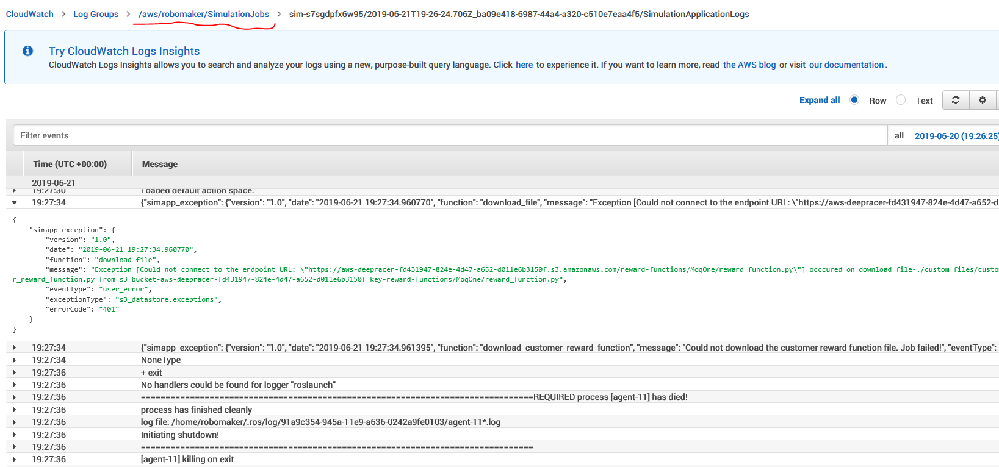
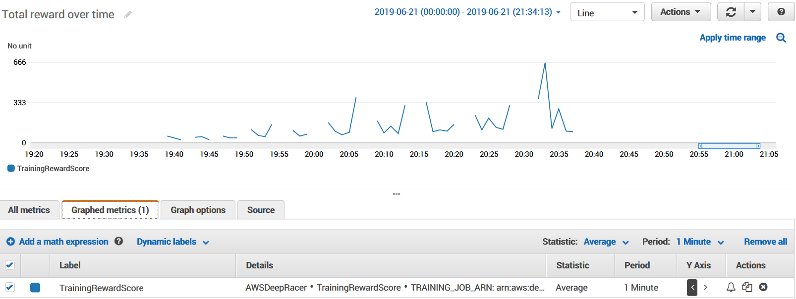
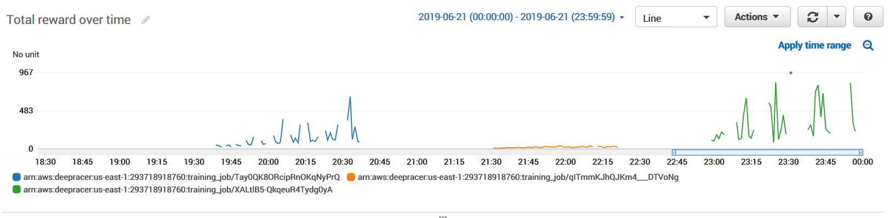
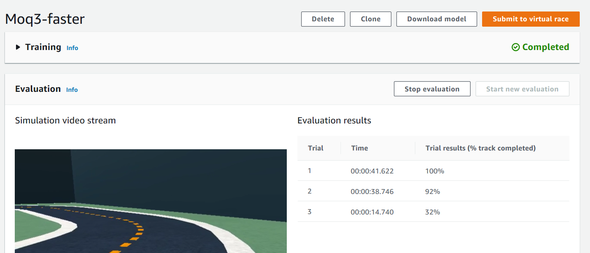
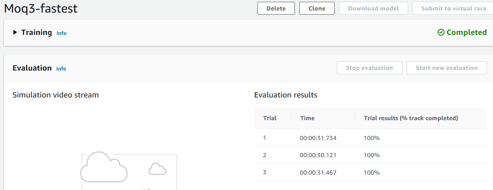
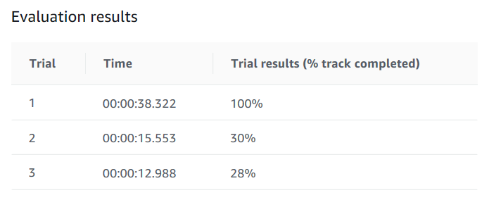
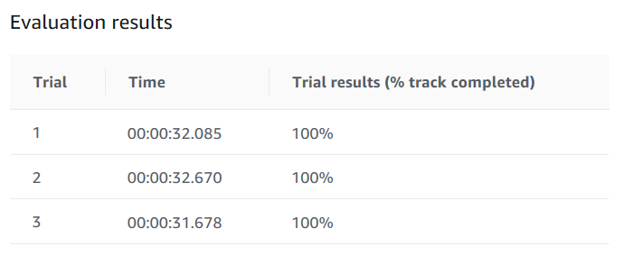

# Simulator Trials

## MoqOne

The first attempt failed due to an agent process crash.



## Moq2

The next attempt used all defaults and trained for `1 hour`

- Max Speed: 1 mps
- Script: [HelloWorld](HelloWorld.py)
- Granularity : 2 speeds
- Action Space : 10 choices
- Best Lap: `1:06.7`



## MoqFast

The next attempt was trained for `1 hours`

- Max Speed: 6mph
- Script: [HelloWorld](HelloWorld.py)
- Granularity: 3 speeds
- Angles: 7
- Action Space: 20

This would take a long time to converge but did provide new insights.

The biggest challenge was accelerating around corners and off the track. This would suggest that we need to account for the tuple `(steering_angle, max_speed)`.

## Moq3

This is a clone of Moq2 with `1 hour training`

It uses the [Moq3.py](Moq3.py) script to give a combined score of `near_center * has_correct_heading`. The theory is that this will become the foundation for addition additional properties.

After an hour here are the results of [Moq3.py]:

- Blue = Moq2 (follow center)git add 
- Orange = MoqFast (follow center + cranked up)
- Green = Moq3 (follow center + correct_heading)

This algo hit a peak of 967 compared to Moq2 only reached 663. It also converged to higher scores within 10 minutes or and performed well until the end. The next step is to add an option of additional speed

The fastest lap was `1:08.1` which is comparable to Moq2 and confirms that we need to _go faster_.



## Moq3-faster

The [Moq3.py](Moq3.py) script was executed against the default parameters.

- Moq3-faster: Speed <= 2mps
- Moq3-fastest: Speed <= 3mps

These were both executed in parallel to speed up collecting results.





## Moq4

The [Moq4.py](Moq4.py) script extends Moq3 with penalty for the car `speed<=0.5` and `max speed=2.0`

There is some effort required for more stability but it did complete one iteration in `0:38.3` seconds.

The likely reason for the reduced stability is that there are corners that require reducing speed to pass through them.



## Moq5

Since Moq3-fastest had the best time and moq3-faster was glitchy that would suggest that `1 hour` might be too short to train.

Moq4 was also flakey so as the minumum speed prevented it from navigating corners. This was naive solution that appears too naive to work.

### Shortest Curved Path

The [ShortestCurvePath](../EfficientPath/ShortestCurvedPath.py) was calculated along with acceleration and velocity vectors.

However it does not appear that `import numpy` is a valid statement according to unit test validation. To mitigate this two solutions are proposed:

- Export the waypoints (eg. to http endpoint) and then calculate the matrix out of band
- Calculate the slope using basic geometry as approximation

```json
lambda_function.DeepRacerError:
{
    "type": "IMPORT_ERROR",
    "message": "No module named 'numpy'",
    "line": "import numpy as np",
    "lineNumber": 2
}
```

## Moq6

The Moq6 has been started with a `2 hour training cycle` and an crude `is_driving_fast_enough` filter based on the slope.

The angles were reduced and the speed granularity increased for faster/tighter cornering. This was based on the video advice of Velociraptor


## Moq7

This is a clone of Moq3-fastest which is still the winning configuration, but using Moq6 rewards.

There is a key difference that each reward category is `sum()` instead of `multiply()` -- this way getting correct answers in a couple categories helps.

Best time = `0:31.6`



## Moq8

This is a clone of Moq7 but the car is given 3 gears with 4.0mps as the upper limit.

A 2 hour training has been kicked off and will be checked on this afternoon.
