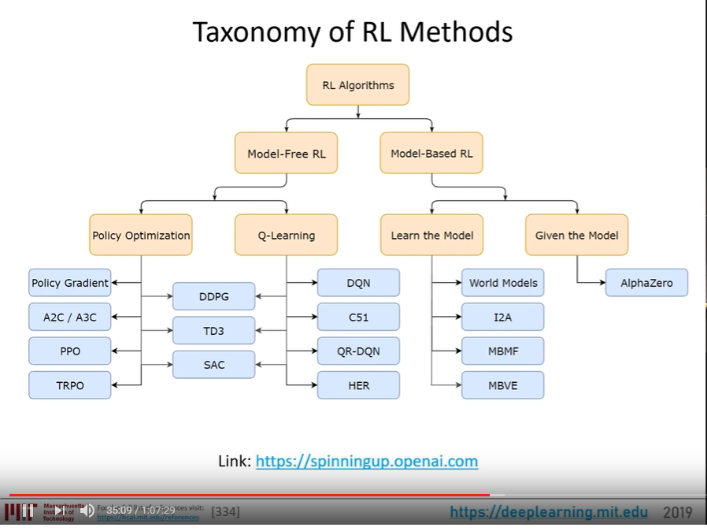
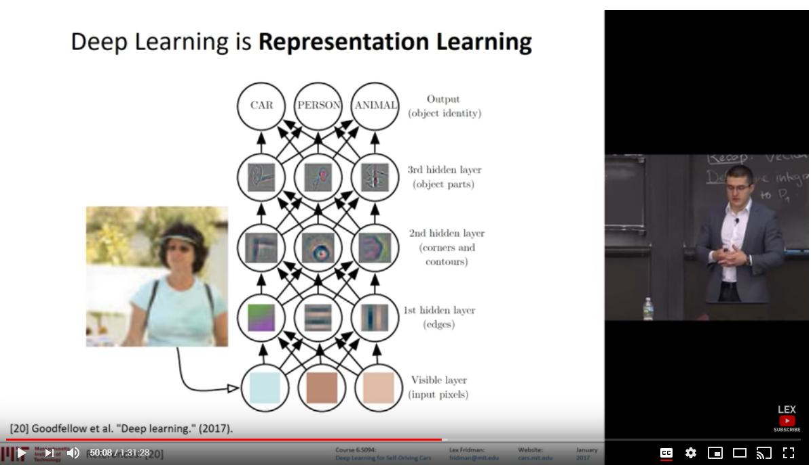

# Videos Reviewed for the Week

## Racing games - Tips and Advices (Part 1)

Viperconcepts provides [a comparative analysis](https://www.youtube.com/watch?v=xZ6i4INmISE) of beginner, amature, and professional drivers.

They evaluate the differences between their styles of driving and explain the rationals.

One of the key take aways was the criticality of `enter slow / exit fast` to efficiently go around corners.

This aligns with the initial Trial results which shows that:

1. Corners are killing reliability
2. Need more speed after the curve and into the straight away

Perhaps a rewards function should be created to encourage that behavior, then the car could go even faster.

## MIT 6.S091: Introduction to Deep Reinforcement Learning (Deep RL)

In this recorded lecture Fridman, Lex provides an extensive explaination of reinforcement learning.

There is significant attention to pit-falls and best practices.

https://www.youtube.com/watch?v=zR11FLZ-O9M

## MIT 6.S094: Introduction to Deep Learning and Self-Driving Cars

Proposes the question is driving more like chess or communication?

Like chess would mean that it is solvable by formalized math rules; versus communication needs semantic reasoning about the evolving context.

There is all significant explaination on neural networks and how various scenarios are approached.

https://youtu.be/1L0TKZQcUtA

